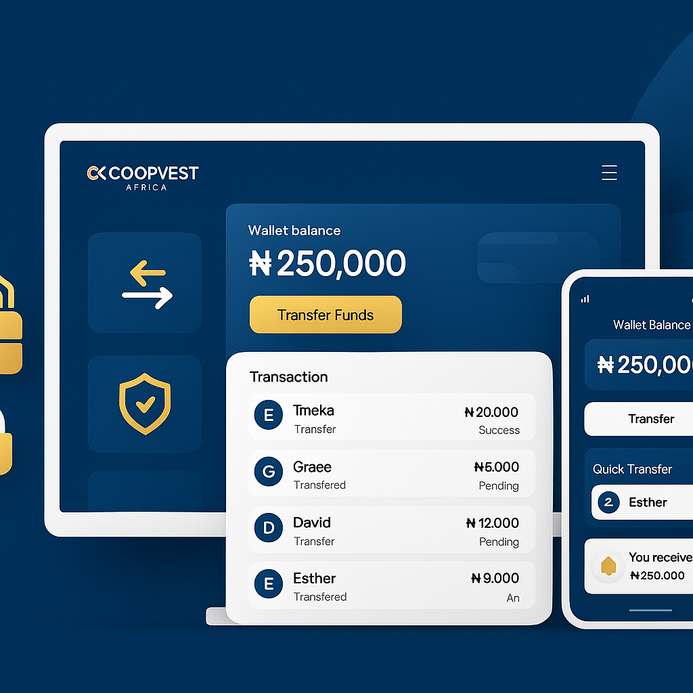

# Coopvest Africa - E-Wallet Dashboard Illustration

A sleek, modern fintech illustration showcasing the E-Wallet dashboard interface for Coopvest Africa. Perfect for website product highlight sections, landing pages, and marketing materials.

## 📋 Contents

This delivery includes:

1. **coopvest-ewallet-dashboard-illustration.png** - High-resolution AI-generated illustration (1920x600px)
2. **ewallet-dashboard-illustration.html** - Fully interactive HTML/CSS implementation with animations

## 🎨 Design Features

### Visual Style
- **Sleek, corporate, fintech-driven** aesthetic
- **Deep blue (#0A2342)** primary color with **gold (#D4A017)** accents
- **White** and light gray backgrounds
- Soft lighting effects and smooth curves
- Professional dashboard interface design
- High clarity with minimal distractions

### Key Visual Elements

#### Left Section - Wallet Features
- 💳 **Digital Wallet** - Secure storage
- ↔️ **Quick Transfer** - Instant payments
- 🔒 **Secure Payment** - Bank-level security

#### Center Section - Desktop Dashboard Mockup
- **Professional dashboard interface** with Coopvest branding
- **Wallet balance display** - ₦250,000
- **Prominent "Transfer Funds" button** - Gold accent
- **Transaction history** showing:
  - Recipient names with avatars
  - Transaction amounts
  - Success status indicators
  - Recent transfer details
- **Rounded interface cards** with soft shadows
- **Clean, organized layout** with proper spacing

#### Right Section - Mobile Wallet App
- **Mobile phone mockup** with realistic design
- **Wallet balance display** - ₦250K
- **Quick action buttons** - Send, Receive, Pay
- **Transaction list** with:
  - Contact avatars
  - Transaction types
  - Amount indicators
  - Status badges

### Design Elements
- ✅ Smooth gradient waves flowing across background
- ✅ Soft shadows beneath all elements for depth
- ✅ Rounded shapes and modern curves
- ✅ Animated wallet icons
- ✅ Professional desktop and mobile mockups
- ✅ Gold accent buttons and indicators
- ✅ Trust, security, and ease-of-use theme
- ✅ Wide landscape layout (1920x600px)

## 🚀 Usage

### Option 1: Use the HTML File (Recommended for Web)

Embed directly into your website:

```html
<!-- Full page embed -->
<iframe src="ewallet-dashboard-illustration.html" width="100%" height="600" frameborder="0" style="border: none;"></iframe>

<!-- Or include as a section -->
<section class="ewallet-section">
    <iframe src="ewallet-dashboard-illustration.html" width="100%" height="600" frameborder="0" style="border: none;"></iframe>
</section>
```

Or copy the HTML/CSS directly into your website's product section.

### Option 2: Use the PNG Image (Static)

Use as a static banner image:

```html

```

### Option 3: Use in Marketing Materials

- Email campaigns
- Social media posts
- Presentation slides
- Blog articles
- Landing pages
- Product pages

## 📱 Responsive Breakpoints

The HTML version is fully responsive:

- **Desktop (1200px+):** Full side-by-side layout with desktop and mobile mockups
- **Tablet (1024px - 1199px):** Optimized spacing and proportions
- **Medium Tablet (768px - 1023px):** Stacked layout with centered content
- **Mobile (480px - 767px):** Compact design with adjusted sizing
- **Small Mobile (<480px):** Minimal layout with essential elements

## 🎯 Brand Colors

- **Primary Blue:** `#0A2342` (Deep Navy)
- **Accent Gold:** `#D4A017` (Premium Gold)
- **Success Green:** `#22c55e` (Status indicator)
- **White:** `#FFFFFF` (Text & Contrast)
- **Secondary Gray:** `#999` (Supporting Text)

## ✨ Interactive Features (HTML Version)

### Animations
- **Slide-in animations** for left wallet icons (staggered delays)
- **Fade-up animation** for center dashboard mockup
- **Slide-in animation** for right mobile mockup
- **Shimmer effects** on icon boxes
- **Wave flow animation** on background
- **Slide-in animations** for transaction items
- **Smooth hover effects** on all interactive elements

### Interactive Elements
- Wallet icons with hover lift effect
- Transfer button with hover state
- Realistic desktop dashboard mockup
- Realistic mobile phone mockup
- Animated transaction lists
- Responsive design for all devices

## 🔧 Customization Guide

### Modify Text Content

```html
<!-- Change wallet balance -->
<div class="balance-amount">₦250,000</div>

<!-- Update transaction details -->
<div class="transaction-name">Tmeka</div>
<div class="transaction-amount">₦20,000</div>

<!-- Adjust feature text -->
<h4>Digital Wallet</h4>
<p>Secure storage</p>
```

### Change Colors

```css
/* Primary blue background */
background: linear-gradient(135deg, #0A2342 0%, #0D3A5C 50%, #051829 100%);

/* Gold accents */
color: #D4A017;

/* Transfer button gradient */
background: linear-gradient(135deg, #D4A017 0%, #E8B923 100%);
```

### Adjust Animations

```css
/* Change animation duration */
animation: slideInLeft 0.8s ease-out forwards;

/* Modify animation delay */
animation-delay: 0.1s;

/* Adjust wave flow speed */
animation: gradientShift 15s ease infinite;
```

### Update Icons

Replace emoji icons with custom SVGs or images:

```html
<!-- Replace emoji -->
<div class="icon-box">💳</div>

<!-- With custom SVG -->
<div class="icon-box">
    <svg><!-- Your SVG here --></svg>
</div>
```

## 📊 Technical Specifications

- **Aspect Ratio:** 16:9 (1920x600px)
- **Format:** PNG (High Resolution) + HTML/CSS
- **PNG File Size:** ~1.2MB
- **HTML File Size:** ~25KB
- **Browser Support:** All modern browsers (Chrome, Firefox, Safari, Edge)
- **Mobile Friendly:** Yes, fully responsive
- **Accessibility:** Semantic HTML, proper contrast ratios
- **Performance:** Optimized animations, smooth 60fps

## 🎬 Animation Details

### Slide-In Left Animation
- **Duration:** 0.8s
- **Easing:** ease-out
- **Effect:** Elements slide in from left with fade
- **Staggered delays:** 0.1s, 0.3s, 0.5s

### Fade-Up Animation
- **Duration:** 0.8s
- **Easing:** ease-out
- **Effect:** Dashboard mockup fades in and moves up

### Slide-In Right Animation
- **Duration:** 0.8s
- **Easing:** ease-out
- **Effect:** Mobile mockup slides in from right

### Shimmer Effect
- **Duration:** 3s
- **Effect:** Subtle shine across elements
- **Infinite loop:** Continuous animation

### Wave Flow Background
- **Duration:** 15s
- **Effect:** Subtle opacity changes
- **Infinite loop:** Continuous animation

### Transaction Slide-In
- **Duration:** 0.6s
- **Easing:** ease-out
- **Staggered delays:** 0.4s, 0.5s, 0.6s

## 🔐 Brand Compliance

This illustration maintains full compliance with Coopvest Africa brand guidelines:

- ✅ Correct color palette (deep blue + gold)
- ✅ Professional fintech aesthetic
- ✅ Dashboard interface design
- ✅ Trust and security emphasis
- ✅ Ease-of-use theme
- ✅ Modern, clean design language
- ✅ Accessibility standards met

## 📝 Integration Examples

### WordPress Integration

```php
<!-- Add to page template -->
<div class="ewallet-section">
    <?php echo do_shortcode('[iframe src="ewallet-dashboard-illustration.html" width="100%" height="600"]'); ?>
</div>
```

### React Component

```jsx
export function EWalletDashboardIllustration() {
    return (
        <iframe 
            src="/ewallet-dashboard-illustration.html" 
            width="100%" 
            height="600" 
            frameBorder="0"
            style={{ border: 'none' }}
        />
    );
}
```

### Vue Component

```vue
<template>
    <iframe 
        src="/ewallet-dashboard-illustration.html" 
        width="100%" 
        height="600" 
        frameborder="0"
        style="border: none;"
    />
</template>
```

### Static HTML

```html
<section class="ewallet-dashboard">
    <h2>E-Wallet Dashboard</h2>
    
</section>
```

## 🎯 Use Cases

1. **Product Page** - Showcase E-Wallet feature
2. **Landing Page** - Hero section or feature highlight
3. **Blog Post** - Explain digital wallet benefits
4. **Email Campaign** - Product announcement
5. **Social Media** - Product promotion
6. **Presentation** - Investor or customer pitch
7. **Mobile App** - Onboarding screens
8. **Marketing Materials** - Brochures and flyers

## 📞 Support & Customization

For questions, modifications, or custom variations:
- Contact the Coopvest Africa design team
- Request custom transaction amounts
- Ask for additional feature illustrations
- Inquire about animation customizations

## 🔄 Version History

- **v1.0** (December 11, 2025) - Initial release
  - AI-generated illustration with sleek dashboard design
  - Interactive HTML/CSS version
  - Full responsive design
  - Comprehensive documentation

---

**Created:** December 11, 2025  
**Status:** Production Ready ✅  
**Last Updated:** December 11, 2025
