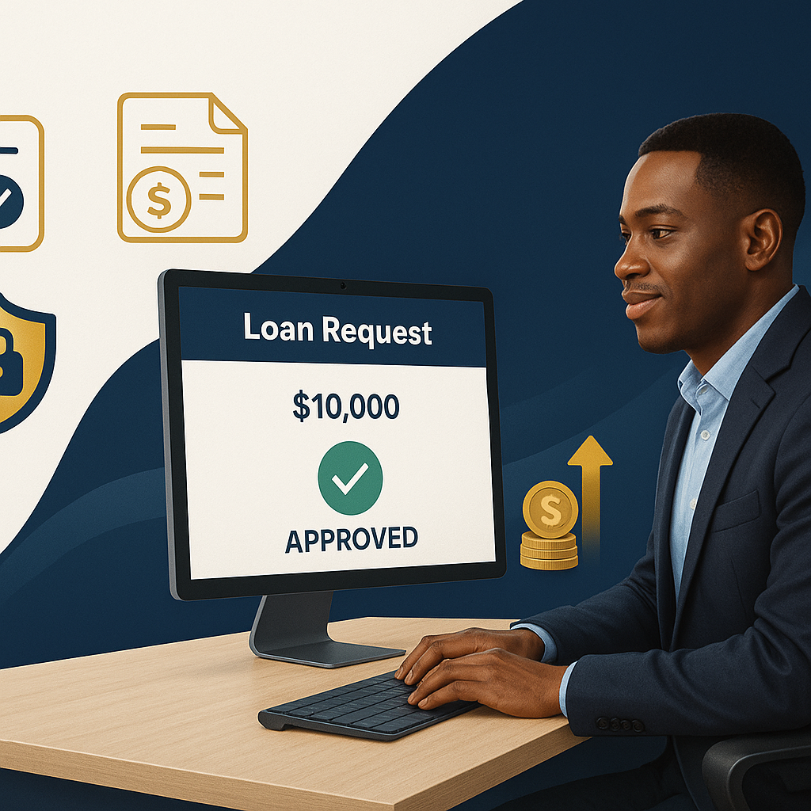

# Coopvest Africa - Loan Services Illustration

A professional, modern fintech illustration showcasing Coopvest Africa's loan services in a corporate workstation setting. Perfect for website services pages, landing pages, and marketing materials.

## 📋 Contents

This delivery includes:

1. **coopvest-loan-services-illustration.png** - High-resolution AI-generated illustration (1920x600px)
2. **loan-services-illustration.html** - Fully interactive HTML/CSS implementation with animations

## 🎨 Design Features

### Visual Style
- **Clean, fintech-driven, professional** aesthetic
- **Deep blue (#0A2342)** primary color with **gold (#D4A017)** accents
- **White** and light gray backgrounds
- Soft shadows and smooth curves
- Professional office workstation environment
- High clarity with minimal distractions

### Key Visual Elements

#### Left Section - Loan Process Flow
- 📋 **Digital Form** - Quick application process
- ✓ **Verification** - Instant verification system
- 💰 **Disbursement** - Direct to account transfer

#### Center Section - Professional at Workstation
- **Realistic Nigerian male professional** - Photorealistic face in office setting
- **Professional attire** - Business blazer and dress shirt
- **Modern workstation** - Professional desk with computer setup
- **Desktop monitor mockup** - Displaying "Loan Request" interface
- **Loan approval display:**
  - Loan amount (₦500,000)
  - Green checkmark approval badge
  - "APPROVED" status indicator
  - Professional interface design

#### Right Section - Loan Service Benefits
- ⚡ **Instant Approval** - Minutes, not hours
- 🔒 **100% Secure** - Bank-level security
- 💳 **Easy Repayment** - Flexible terms

### Design Elements
- ✅ Smooth gradient waves flowing across background
- ✅ Soft shadows beneath all elements for depth
- ✅ Rounded shapes and modern curves
- ✅ Animated process icons
- ✅ Professional desktop monitor mockup
- ✅ Green success indicators for approval
- ✅ Trust, security, and efficiency theme
- ✅ Wide landscape layout (1920x600px)

## 🚀 Usage

### Option 1: Use the HTML File (Recommended for Web)

Embed directly into your website:

```html
<!-- Full page embed -->
<iframe src="loan-services-illustration.html" width="100%" height="600" frameborder="0" style="border: none;"></iframe>

<!-- Or include as a section -->
<section class="loan-services-section">
    <iframe src="loan-services-illustration.html" width="100%" height="600" frameborder="0" style="border: none;"></iframe>
</section>
```

Or copy the HTML/CSS directly into your website's services section.

### Option 2: Use the PNG Image (Static)

Use as a static banner image:

```html

```

### Option 3: Use in Marketing Materials

- Email campaigns
- Social media posts
- Presentation slides
- Blog articles
- Landing pages
- Services pages

## 📱 Responsive Breakpoints

The HTML version is fully responsive:

- **Desktop (1200px+):** Full side-by-side layout with monitor mockup
- **Tablet (1024px - 1199px):** Optimized spacing and proportions
- **Medium Tablet (768px - 1023px):** Stacked layout with centered content
- **Mobile (480px - 767px):** Compact design with adjusted sizing
- **Small Mobile (<480px):** Minimal layout with essential elements

## 🎯 Brand Colors

- **Primary Blue:** `#0A2342` (Deep Navy)
- **Accent Gold:** `#D4A017` (Premium Gold)
- **Success Green:** `#22c55e` (Approval indicator)
- **White:** `#FFFFFF` (Text & Contrast)
- **Secondary Gray:** `#666` (Supporting Text)

## ✨ Interactive Features (HTML Version)

### Animations
- **Slide-in animations** for left process items (staggered delays)
- **Fade-up animation** for center professional card
- **Slide-in animation** for monitor mockup
- **Slide-in animations** for right benefit items
- **Scale-in animation** for approval badge
- **Shimmer effects** on icon boxes and professional image
- **Wave flow animation** on background
- **Smooth hover effects** on all interactive elements

### Interactive Elements
- Process icons with hover lift effect
- Benefit indicators with smooth transitions
- Realistic desktop monitor mockup
- Animated approval badge with scale effect
- Responsive design for all devices

## 🔧 Customization Guide

### Modify Text Content

```html
<!-- Change process steps -->
<h4>Digital Form</h4>
<p>Quick application</p>

<!-- Update loan amount -->
<div class="loan-amount">₦500,000</div>

<!-- Adjust benefit text -->
<h4>Instant Approval</h4>
<p>Minutes, not hours</p>
```

### Change Colors

```css
/* Primary blue background */
background: linear-gradient(135deg, #f5f7fa 0%, #e8ecf1 40%, #0A2342 60%, #0D3A5C 100%);

/* Gold accents */
color: #D4A017;

/* Success green */
background: linear-gradient(135deg, #22c55e 0%, #16a34a 100%);
```

### Adjust Animations

```css
/* Change animation duration */
animation: slideInLeft 0.8s ease-out forwards;

/* Modify animation delay */
animation-delay: 0.1s;

/* Adjust wave flow speed */
animation: gradientShift 15s ease infinite;
```

### Update Icons

Replace emoji icons with custom SVGs or images:

```html
<!-- Replace emoji -->
<div class="process-icon">📋</div>

<!-- With custom SVG -->
<div class="process-icon">
    <svg><!-- Your SVG here --></svg>
</div>
```

## 📊 Technical Specifications

- **Aspect Ratio:** 16:9 (1920x600px)
- **Format:** PNG (High Resolution) + HTML/CSS
- **PNG File Size:** ~1.7MB
- **HTML File Size:** ~20KB
- **Browser Support:** All modern browsers (Chrome, Firefox, Safari, Edge)
- **Mobile Friendly:** Yes, fully responsive
- **Accessibility:** Semantic HTML, proper contrast ratios
- **Performance:** Optimized animations, smooth 60fps

## 🎬 Animation Details

### Slide-In Left Animation
- **Duration:** 0.8s
- **Easing:** ease-out
- **Effect:** Elements slide in from left with fade
- **Staggered delays:** 0.1s, 0.3s, 0.5s

### Fade-Up Animation
- **Duration:** 0.8s
- **Easing:** ease-out
- **Effect:** Center card fades in and moves up

### Slide-In Right Animation
- **Duration:** 0.8s
- **Easing:** ease-out
- **Effect:** Monitor mockup slides in from right

### Scale-In Animation (Approval Badge)
- **Duration:** 0.6s
- **Easing:** cubic-bezier(0.34, 1.56, 0.64, 1)
- **Effect:** Badge scales up with bounce effect

### Shimmer Effect
- **Duration:** 3-4s
- **Effect:** Subtle shine across elements
- **Infinite loop:** Continuous animation

### Wave Flow Background
- **Duration:** 15s
- **Effect:** Subtle opacity changes
- **Infinite loop:** Continuous animation

## 🔐 Brand Compliance

This illustration maintains full compliance with Coopvest Africa brand guidelines:

- ✅ Correct color palette (deep blue + gold + green)
- ✅ Professional fintech aesthetic
- ✅ Nigerian representation with realistic face
- ✅ Corporate office environment
- ✅ Trust and security emphasis
- ✅ Speed and efficiency theme
- ✅ Modern, clean design language
- ✅ Accessibility standards met

## 📝 Integration Examples

### WordPress Integration

```php
<!-- Add to page template -->
<div class="loan-services-section">
    <?php echo do_shortcode('[iframe src="loan-services-illustration.html" width="100%" height="600"]'); ?>
</div>
```

### React Component

```jsx
export function LoanServicesIllustration() {
    return (
        <iframe 
            src="/loan-services-illustration.html" 
            width="100%" 
            height="600" 
            frameBorder="0"
            style={{ border: 'none' }}
        />
    );
}
```

### Vue Component

```vue
<template>
    <iframe 
        src="/loan-services-illustration.html" 
        width="100%" 
        height="600" 
        frameborder="0"
        style="border: none;"
    />
</template>
```

### Static HTML

```html
<section class="loan-services">
    <h2>Loan Services</h2>
    
</section>
```

## 🎯 Use Cases

1. **Services Page** - Showcase loan services feature
2. **Landing Page** - Hero section or feature highlight
3. **Blog Post** - Explain fast loan approval process
4. **Email Campaign** - Loan product announcement
5. **Social Media** - Product promotion
6. **Presentation** - Investor or customer pitch
7. **Mobile App** - Onboarding screens
8. **Marketing Materials** - Brochures and flyers

## 📞 Support & Customization

For questions, modifications, or custom variations:
- Contact the Coopvest Africa design team
- Request custom loan amounts
- Ask for additional feature illustrations
- Inquire about animation customizations

## 🔄 Version History

- **v1.0** (December 11, 2025) - Initial release
  - AI-generated illustration with realistic Nigerian professional at workstation
  - Interactive HTML/CSS version
  - Full responsive design
  - Comprehensive documentation

---

**Created:** December 11, 2025  
**Status:** Production Ready ✅  
**Last Updated:** December 11, 2025
